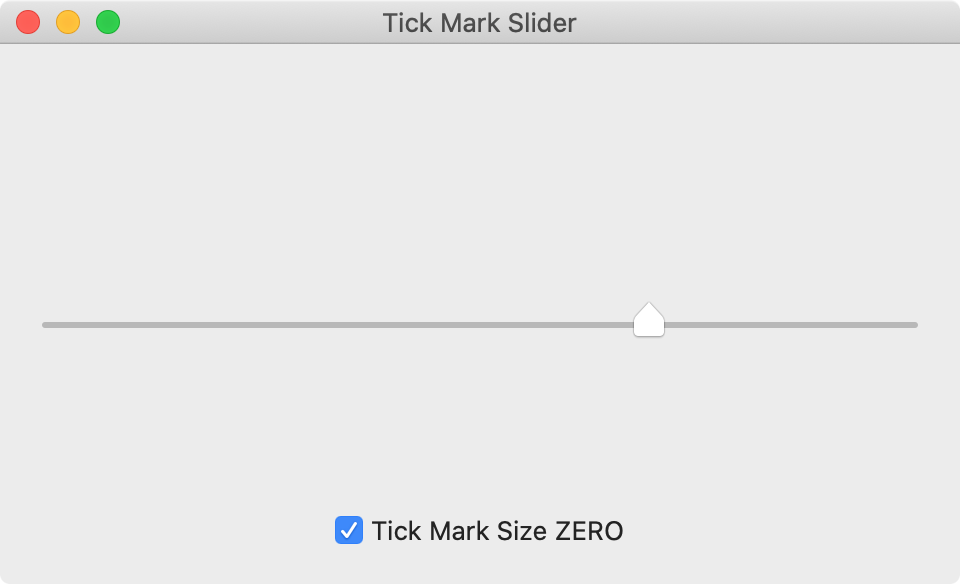
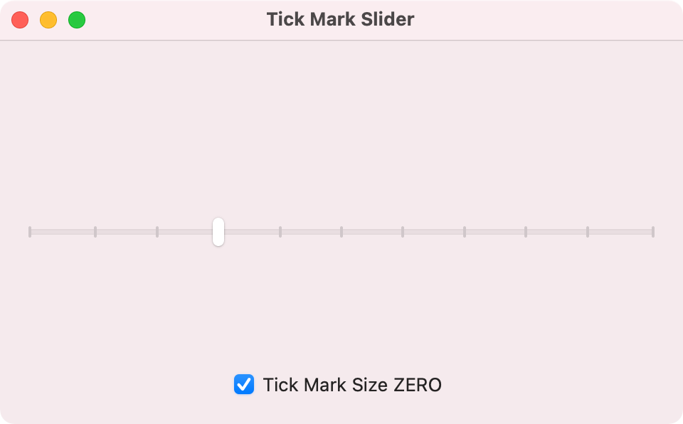

# NSSlider's customized tick mark rect size is ignored in macOS 11

## Speps to reproduce

in macOS 11 Big Sur

1. Open 'feedback.apple.macOS-11.zerosize-tickmark-slider' project in Xcode
2. Build and run application

### Expected result 

If 'Tick Mark Size ZERO' check is ON, NO tick marks on slider.
(If in macOS 10.15 or earlier, actual result == expected result)



### Actual result

All tick marks always exsist on slider, regardless of 'Tick Mark Size ZERO' check status.



## Note

In sample project, NSSlider's method

```swift
override func rectOfTickMark(at index: Int) -> NSRect
```

returns ```CGSize.zero```  sized ```NSRect``` . This means valid tick mark area has zero width and zero height, in that case I think tick mark should be invisible (as same as macOS 10.15 or earlier).
